# Enable generative AI features for a space
1. Open the CodeCatalyst console at https://codecatalyst.aws/.
2. Navigate to your CodeCatalyst space. Choose Settings, and then choose Generative AI.
3. To enable generative AI features for all projects in your space, choose the Projects in this space can access generative AI features toggle and make sure it is in the on position. Users in projects will immediately have access to the generative AI features available to their roles in those projects.

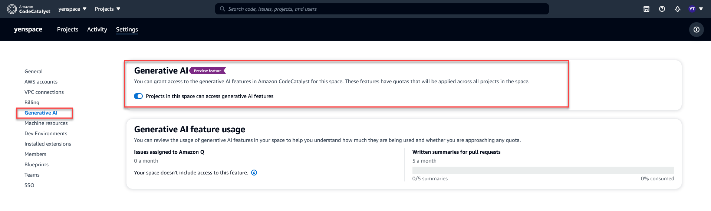

# Creating a project with the Modern three-tier web application blueprint

When you create a project with the Modern three-tier web application blueprint, your project is created with the following resources:

In the CodeCatalyst project:
- A source repository with sample code and workflow YAML
- A workflow that builds and deploys the sample code whenever a change is made to the default branch
- An issues board and backlog that you can use to plan and track work
- A test reports suite with automated reports included in the sample code

In the associated AWS account:
- Three AWS CloudFormation stacks that create the resources needed for the application.

Create the Modern three-tier web application project:

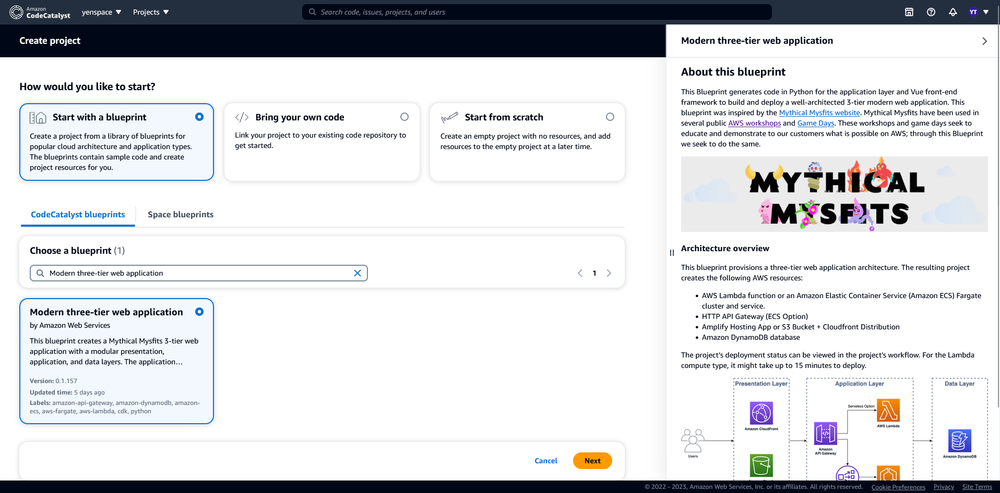

# View your source repository
Your blueprint installs a source repository that contains files to define and support your application or service. A few noteworthy directories and files in the source repository are:

- ``.cloud9 directory` – Contains supporting files for the AWS Cloud9 Dev Environment.
- `.codecatalyst directory` – Contains the YAML workflow definition file for each workflow included in the blueprint.
- `.idea directory` – Contains supporting files for the JetBrains Dev Environments.
- `.vscode directory` – Contains supporting files for the Visual Studio Code Dev Environment.
- `cdkStacks directory` – Contains the AWS CDK stack files that define the infrastructure in the AWS Cloud.
- `src directory` – Contains the application source code.
- `tests directory` – Contains files for the integ and unit tests that are run as part of the automated CI/CD workflow that runs when you build and test your application.
- `web directory` – Contains the frontend source code. Other files include project files such as the package.json file that contains important metadata about your project, the index.html page for the website, the .eslintrc.cjs file for linting code, and the tsconfig.json file for specifying root files and compiler options.
- `Dockerfile file` – Describes the application's container.
- `README.md` file – Contains configuration information for the project.

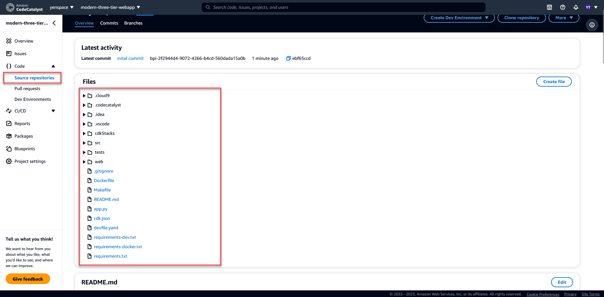

# Create a summary of the code changes between branches when creating a pull request

## To create a branch (console)
1. In the CodeCatalyst console, navigate to the project where your source repository resides.
2. Choose the name of the repository from the list of source repositories for the project. Alternatively, in the navigation pane, choose **Code**, and then choose **Source repositories**.
3. Choose the repository where you want to create a branch.
4. On the overview page of the repository, choose **More**, and then choose   **Create branch**.
5. Enter a name for the branch.
6. Choose a branch to create the branch from, and then choose **Create**.

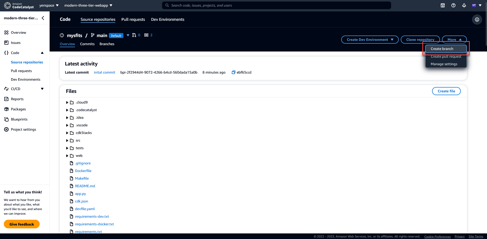

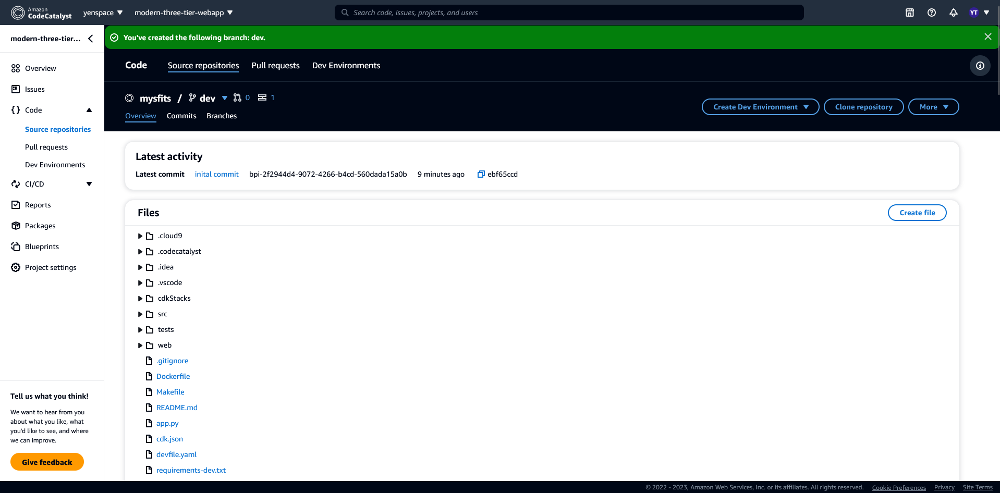

Once you have a branch, edit a file in that branch with a simple change. In this example, you'll edit the `test_endpoint.py` file to change the number of retries for tests from `3` to `5`.

## To edit the test_endpoint.py file in the console
1. On the overview page for the `mysfits` source repository, choose the branch drop-down and choose the branch you created in the previous procedure.
2. In **Files**, navigate to the file you want to edit. For example, to edit the `test_endpoint.py` file, expand tests, expand integ, and then choose `test_endpoint.py`.
3. Choose **Edit**.
4. On line 7, change the number of times all tests will be retried from:
```
def test_list_all(retry=3):
```
to:
```
def test_list_all(retry=5):
```
5. Choose Commit and commit your changes to your branch.

Now that you have a branch with a change, you can create a pull request.

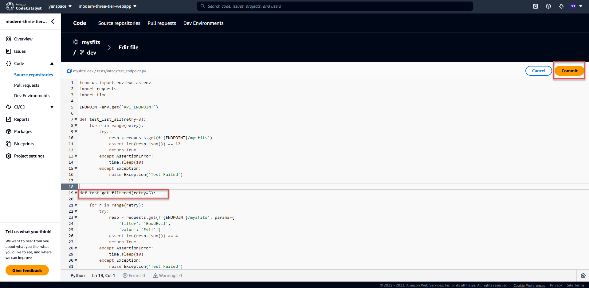

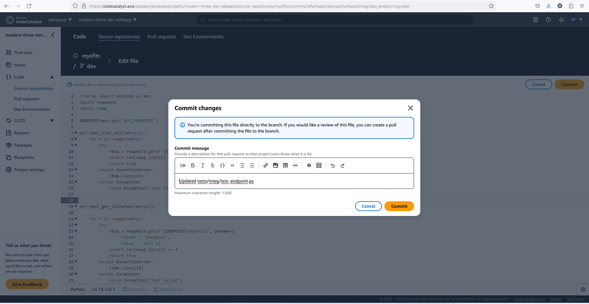

Create a pull request with a summary of the changes
1. On the overview page of the repository, choose **More**, and then choose **Create pull request**.
2. In **Destination branch**, choose the branch to merge the code into after it is reviewed.
3. In **Source branch**, choose the branch that contains the changes you just committed to the test_endpoint.py file.
4. In **Pull request title**, enter a title that helps other users understand what needs to be reviewed and why.
5. In **Pull request description**, choose **Write description for me** to have CodeCatalyst create a description of the changes contained in the pull request.
6. A summary of the changes appears. Review the suggested text and then choose **Accept and add to description**.
7. Optionally modify the summary to better reflect the changes you made to the code. You can also choose to add reviewers or link issues to this pull request. When you have finished making any additional changes you want, choose **Create**.

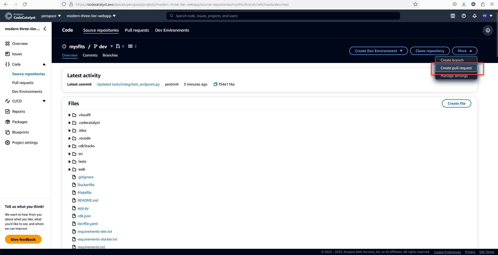

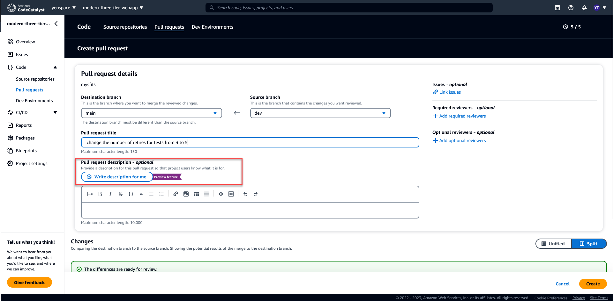

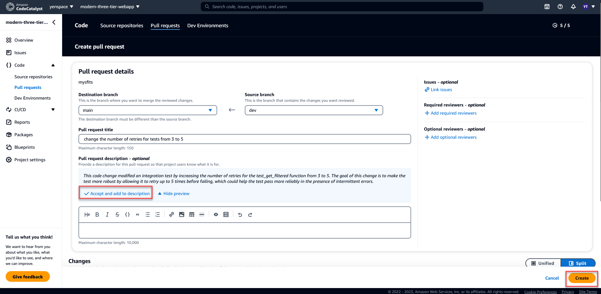

# Create a summary of comments left on code changes in a pull request

When users review a pull request, they often leave multiple comments on the changes in that pull request. If there are a lot of comments from a lot of reviewers, it can be difficult to pick out common themes in the feedback, or even be sure that you've reviewed all the comments in all revisions. You can use the **Create comment summary** feature to have Amazon Q analyze all the comments left on code changes in a pull request and create a summary of those comments.

## To create a summary of comments in a pull request
1. Navigate to the pull request you created in the previous procedure. 
2. Add a few comments to the pull request in Changes if the pull request does not already have comments.
3. In Overview, choose Create comment summary. When complete, the Comment summary section expands.

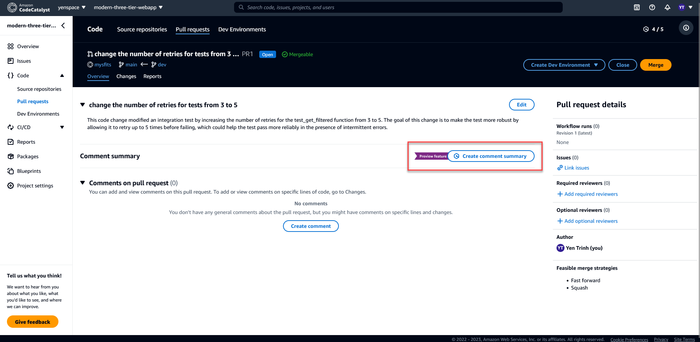

4. Review the summary of comments left on changes in the code in revisions of the pull request, and compare it to the comments in the pull request.

# Create an issue and assign it to Amazon Q
## To create an issue and have a solution generated for you to evaluate
1. In the navigation pane, choose Issues and make sure you are in the **Board** view.
2. Choose **Create issue**.
3. Give the issue a title that explains what you want to do in plain language. For example, for this issue, enter a title of `Create another mysfit named Quokkapus`. In **Description**, provide the following details:

```
Expand the table of mysfits to 13, and give the new mysfit the following characteristics:

Name: Quokkapus

Species: Quokka-Octopus hybrid

Good/Evil: Good

Lawful/Chaotic: Chaotic

Age: 216

Description: Australia is full of amazing marsupials, but there's nothing there quite like the Quokkapus. 
She's always got a friendly smile on her face, especially when she's using her eight limbs to wrap you up 
in a great big hug. She exists on a diet of code bugs and caffeine. If you've got some gnarly code that needsa
assistance, adopt Quokkapus and put her to work - she'll love it! Just make sure you leave enough room for 
her to grow, and keep that coffee coming.
```
4. (Optional) Attach an image to use as the thumbnail and profile picture for the mysfit to the issue. If you do this, update the description to include details of what images you want to use and why. For example, you might add the following to the description: `The mysfit requires image files to be deployed to the website. Add these images to the source repository.`

Review the description and make sure it contains all the details that might be needed before you proceed to the next step.

5. In **Assignees**, choose **Assign to Amazon Q**.

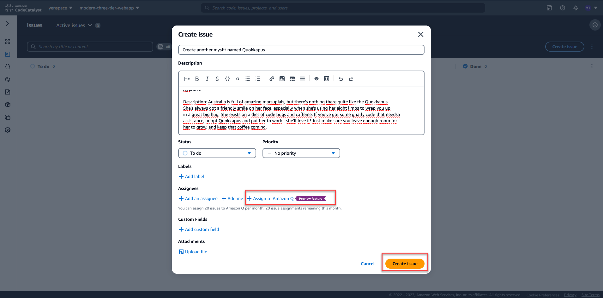

**Note**: You have to be in Enterprise tier to assign an issue to Amazon Q.

6. Choose **Create issue**. Your view changes to the Issues board.

7. Choose **Create issue** to create another issue, this time one with the title `Change the get_all_mysfits() API to return mysfits sorted by the Age attribute`. Assign this issue to **Amazon Q** and create the issue.

8. Choose **Create issue** to create another issue, this time one with the title `Update the OnPullRequest workflow to include a branch named test in its triggers`. Optionally link to the workflow in the description. Assign this issue to **Amazon Q** and create the issue to return to the Issues board.

Within a few moments of being assigned each issue, the issue will change to a **Blocked** state. 

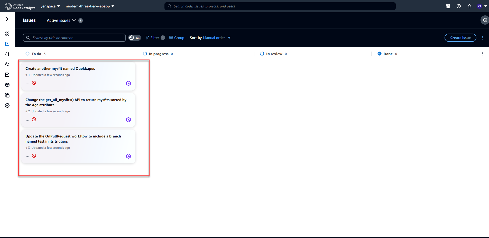

Open the first issue you created, the one that creates a new mysfit. Review the choices and accept the defaults for the first two questions. Make sure that the source repository is the one created by the blueprint for the mysfits source code, and then choose **Confirm**. 

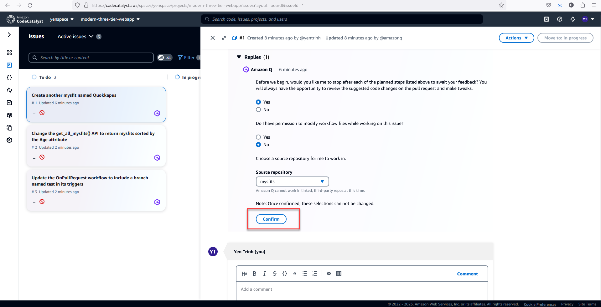

Once you have chosen your preferences and confirmed them, the issues will move into **In progress**. 

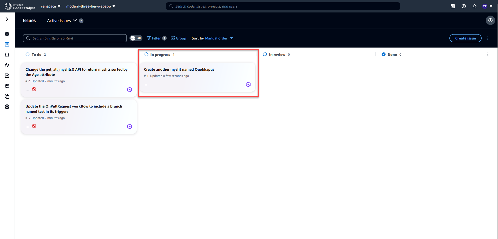

Do the same for the second issue. For the third issue, where you requested that it update a workflow, make sure that you choose **Yes** to allow Amazon Q to modify workflow files.

Amazon Q will add comments tracking its progress inside the issue. If it is able to define an approach to a solution, it will update the issue's description with a **Background** section that contains its analysis of the code base and a **Approach** section that details its proposed approach to creating a solution.

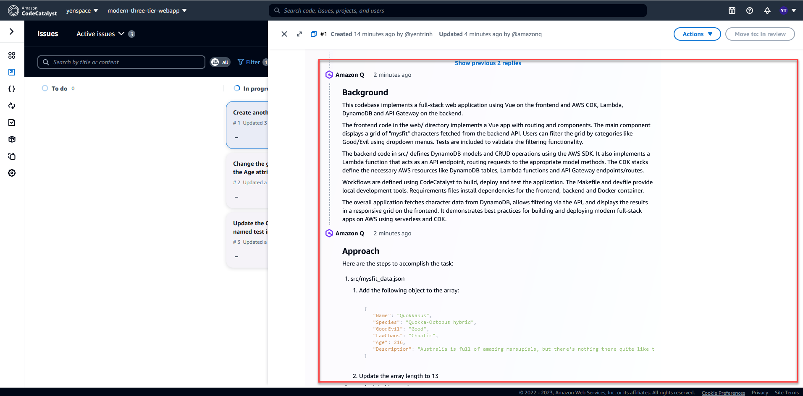


If Amazon Q is successful in coming up with a solution to the problem described in the issue, it will create a branch and code changes in that branch that implement its proposed solution. Once the code is ready, it creates a pull request so that you can review the suggested code changes, adds a link to that pull request to the issue, and moves the issue into **In review**.


## To review an issue and linked pull request that contains changes made by Amazon Q

1. In **Issues**, choose an issue assigned to Amazon Q that is in **In progress**. Review the comments to monitor the progress of the bot. If present, review the background and approach it records in the description of the issue, and then choose X to close the issue pane.

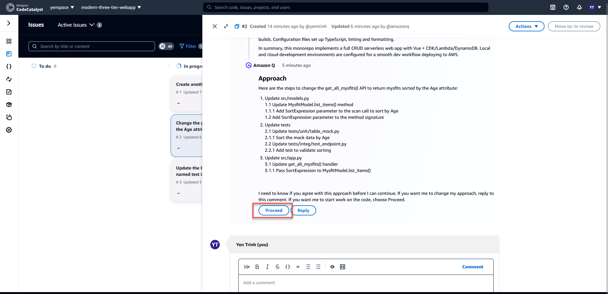

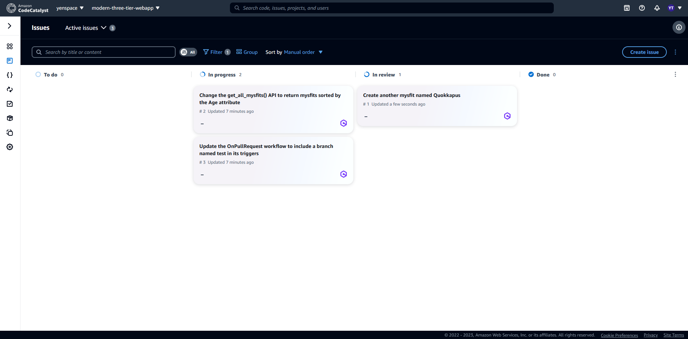

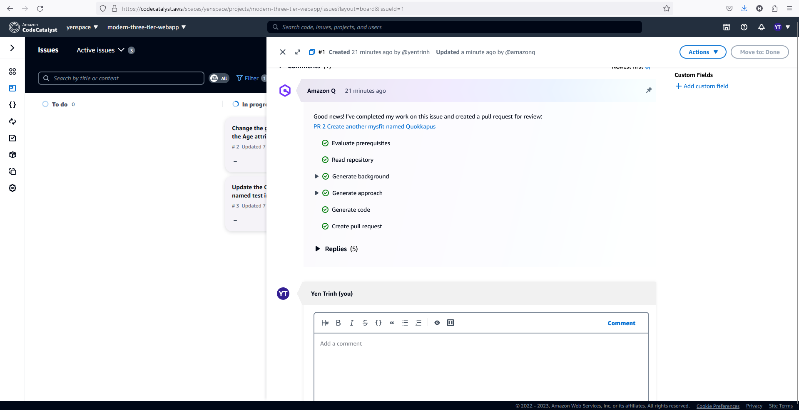

2. Now choose an issue assigned to Amazon Q that is in In review. Review the background and approach it records in the description of the issue. Review the comments to understand the actions it performed. In Pull requests, choose the link to the pull request next to the Open label to review the code.

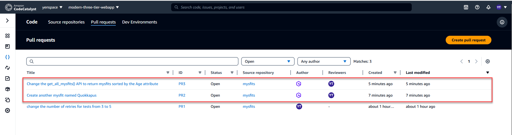

3. In the pull request, review the code changes. For more information, see Reviewing a pull request. Leave comments on the pull request if you want Amazon Q to change any of its suggested code. Be specific when leaving comments for Amazon Q for best results.

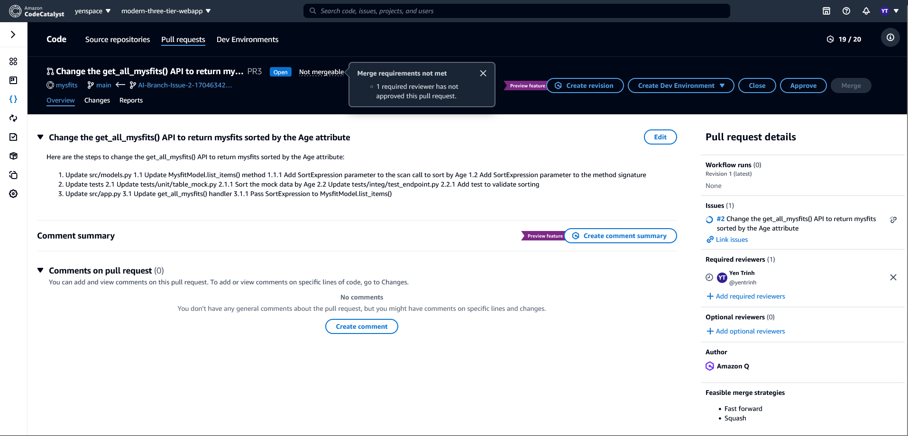

4. (Optional) After you and other project users have left all the comments you want for changes to the code, choose Create revision to have Amazon Q create a revision of the pull request that incorporates the changes you requested in comments. Progress on the revision creation progress will be reported by Amazon Q in Overview, not in Changes. Make sure to refresh your browser to view the latest updates from Amazon Q on creating the revision.

5. A workflow is run for each pull request in this example project. Make sure that you see a successful workflow run before you merge the pull request. You can also choose to create additional workflows and environments to test the code before you merge it. For more information, see Getting started with workflows in CodeCatalyst.

6. When you are satisfied with the latest revision of the pull request, choose Merge.

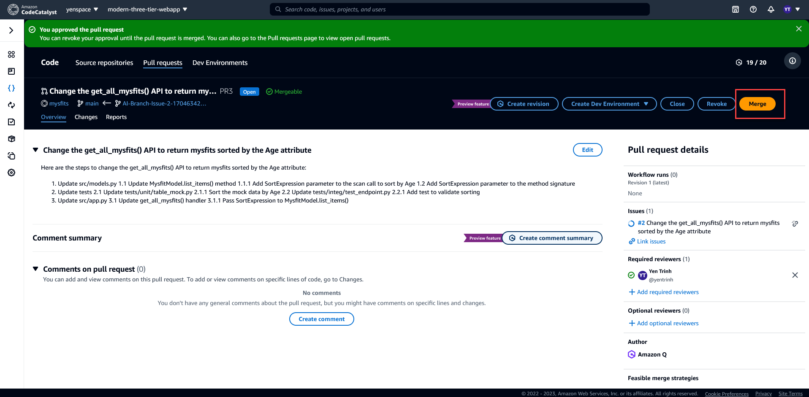

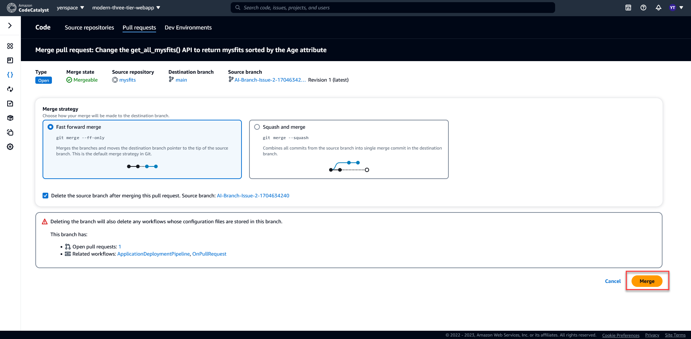