# Create a custom blueprint
1. Open the CodeCatalyst console at https://codecatalyst.aws/.

2. In the CodeCatalyst console, navigate to the space where you want to create a blueprint.

3. Choose **Settings** to navigate to the space settings.

4. In the **Space settings** tab, choose **Blueprints** and choose **Create blueprint**.

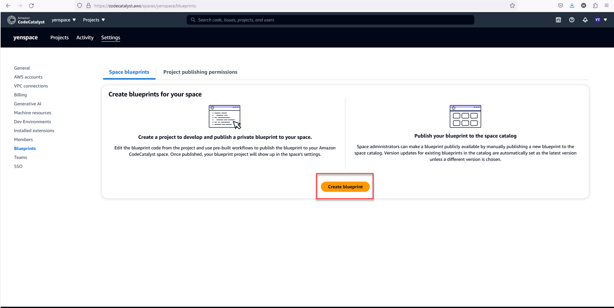

5. Update the fields in the blueprint creation wizard with the following values:

- In **Blueprint name**, enter `react-app-blueprint`.

- In **Blueprint Display Name**, enter `react-app-blueprint`.

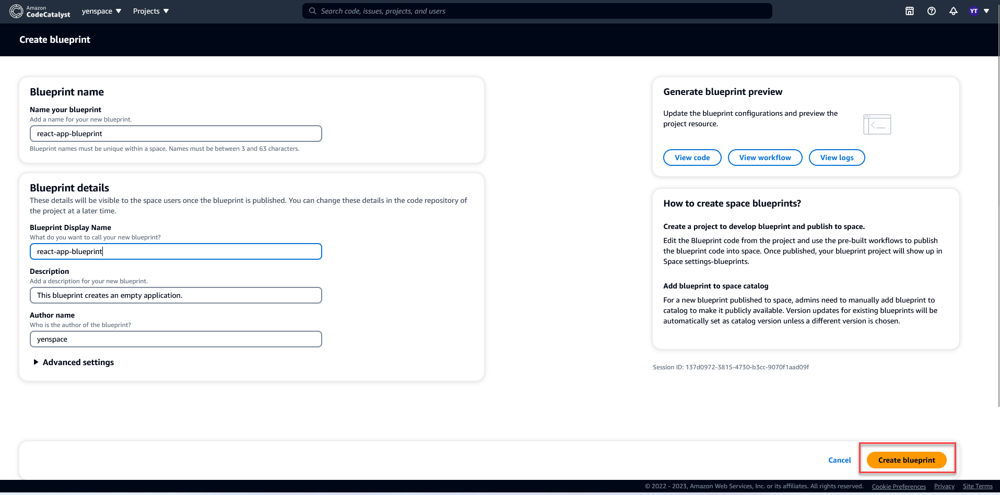

6. Optionally, choose **View code** to preview the blueprint source code for your blueprint. Likewise, choose **View workflow** to preview the workflow that will be created in the project that builds and publishes the blueprint.

7. Choose Create blueprint.

8. Once your blueprint is created, you are taken to the blueprint's project. This project contains the blueprint source code, along with the tools and resources you need to develop, test, and publish the blueprint. A release workflow was generated and it automatically published your blueprint to the space.

9. Now that your blueprint and blueprint project is created, the next step is to configure it by updating the source code. You can use Dev Environments to open and edit your source repository directly in your browser.

In the navigation pane, choose **Code**, and then choose **Dev Environments**.

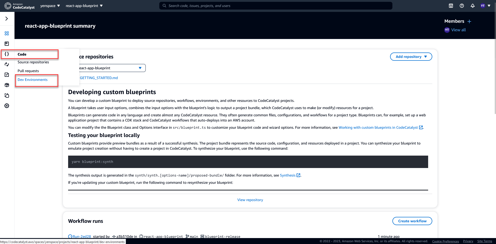

10. Choose **Create Dev Environment** and then choose **AWS Cloud9 (in browser)**.

11. Keep the default settings and choose **Create**.

12. In the AWS Cloud9 terminal, navigate to your blueprint project directory by running the following command:

```
cd react-app-blueprint
```
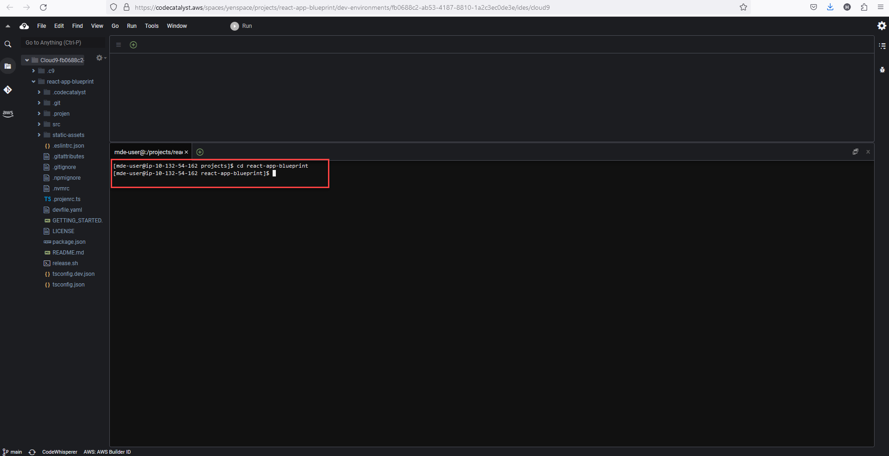

13. A static-assets folder is created and filled automatically when a blueprint is created. In this tutorial, you will delete the default folder and generate a new one for a react app blueprint.

Delete the static-assets folder by running the following command:

```
rm -r static-assets
```
14. Now that the default folder is deleted, create a static-assets folder for a react-app blueprint by running the following command:

```
npx create-react-app static-assets
```

If prompted, enter y to proceed.

A new react application was created in the static-assets folder with necessary packages. The changes need to pushed to your remote CodeCatalyst source repository.

15. Ensure you have the latest changes, and then commit and push the changes to the blueprint's CodeCatalyst source repository by running the following commands:

```
git pull

git add .

git commit -m "Add React app to static-assets"

git push
```
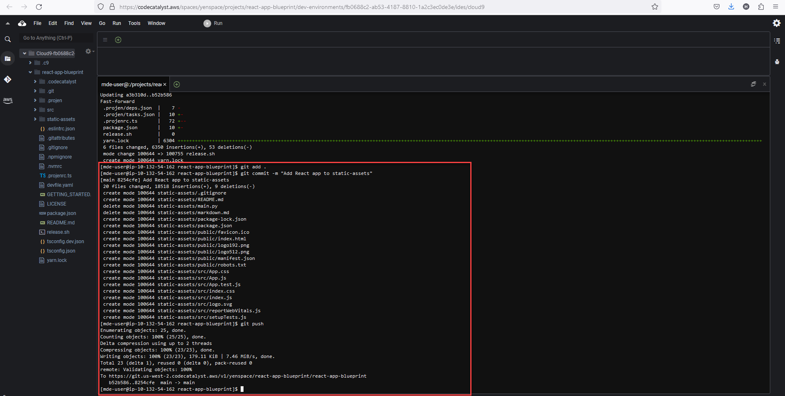

When a change is pushed to the blueprint's source repository, the release workflow is automatically started. This workflow increments the blueprint version, builds the blueprint, and publishes it to your space. In the next step, you'll navigate to the release workflow run to see how it's doing.

# View release workflow
1. In the CodeCatalyst console, in the navigation pane, choose **CI/CD**, and then choose **Workflows**.

2. Choose the **blueprint-release** workflow.

3. You can see the workflow has actions to build and publish the blueprint.

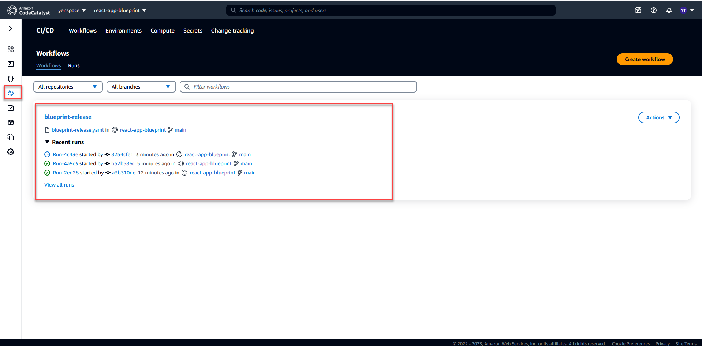

4. Under **Latest run**, choose the workflow run link to view the run from the code change you made.

5. Once the run is completed, your new blueprint version is published. Published blueprint versions can be seen in your space **Settings**, but can't be used in projects until it's added to the space's blueprints catalog. In the next step, you'll add the blueprint to the catalog.

# Add blueprint to catalog
1. In the CodeCatalyst console, navigate back to the space.
2. Choose **Settings**, and then choose **Blueprints**.
3. Choose **react-app-blueprint**, and then choose **Add to catalog**.
4. Choose **Save**.

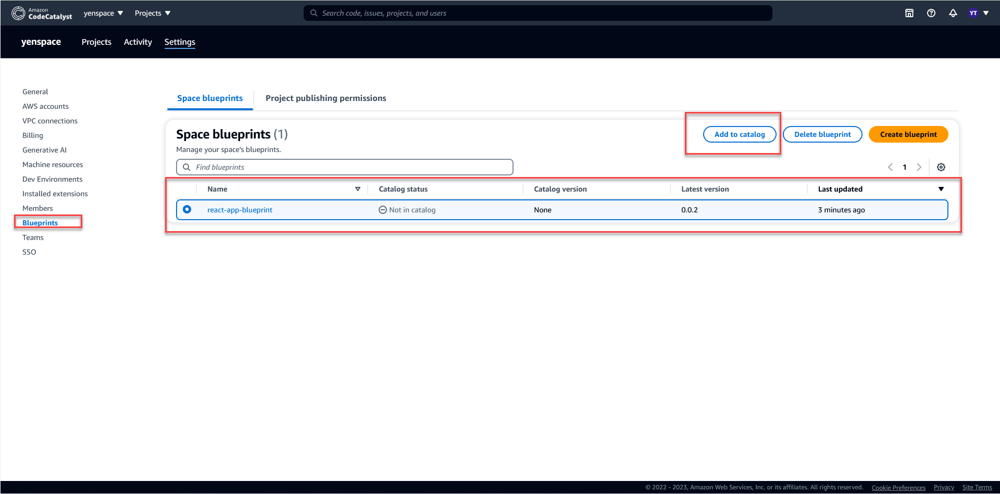

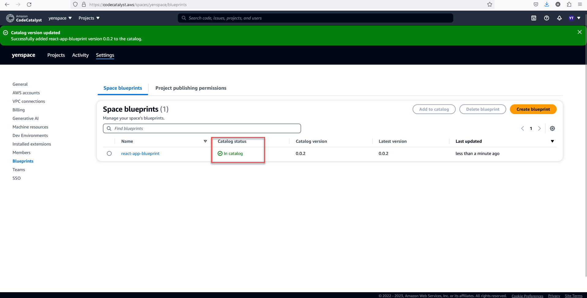

# Create project with blueprint
1. Choose the **Projects** tab and then choose **Create project**.
2. Choose **Space blueprints**, and then choose **react-app-blueprint**.
3. Choose **Next**.
4. Enter the project name as a blueprint user: `react-app-project`.

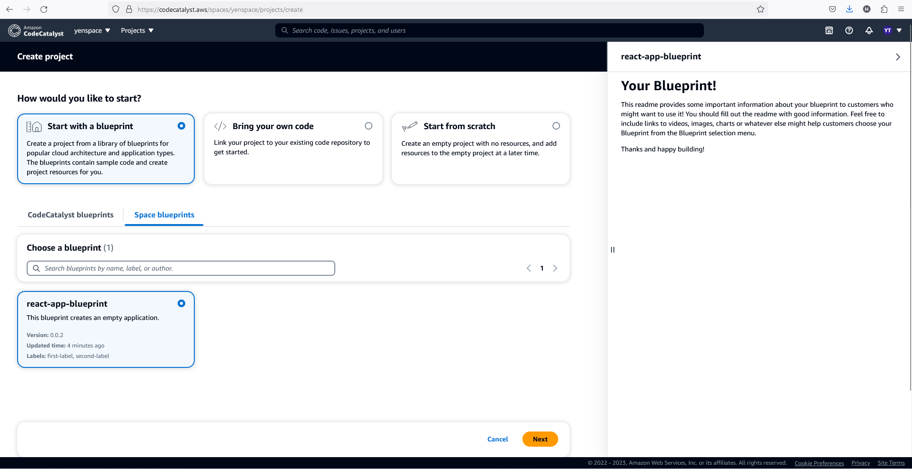

# Update blueprint
1. Navigate to the **react-app-blueprint** project created in the step Create a custom blueprint.

2. Open the Dev Environment created in Step create a custom blueprint.

- In the navigation pane, choose **Code**, and then choose **Dev Environments**.

- From the table, find the **Dev Environment**, and then choose **Open in AWS Cloud9 (in browser)**.

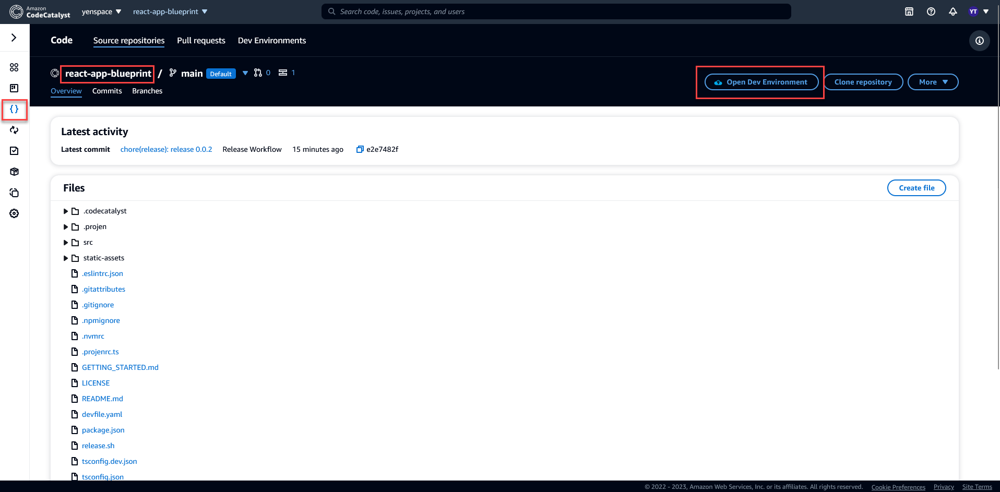

3. When the blueprint release workflow was run, it incremented the blueprint version by updating the `package.json` file. Pull that change in by running the following command in the AWS Cloud9 terminal:

```
git pull
```
4. Navigate to the static-assets folder by running the following command:

```
cd /projects/react-app-blueprint/static-assets
```

5. Create a `hello-world.txt` file in static-assets folder by running the following command:

```
touch hello-world.txt
```

6. In the left-hand navigation, double-click the hello-world.txt file to open it in the editor, and add the following contents:

```
Hello, world!
```
7. Save the file.
Ensure you have the latest changes, and then commit and push the changes to the blueprint's CodeCatalyst source repository by running the following commands:

```
git pull

git add .

git commit -m "prettier setup"

git push
```

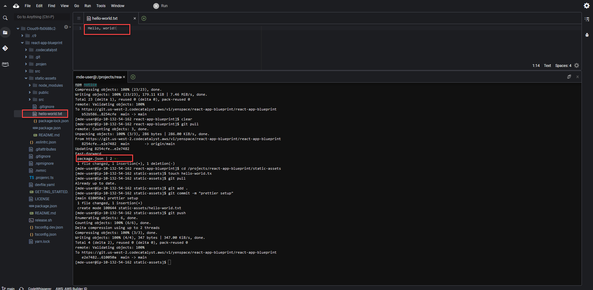

Pushing the changes started the release workflow, which will automatically publish the new version of the blueprint to the space.

# Update the blueprint's published catalog version to the new version
1. In the CodeCatalyst console, navigate back to the space.
2. Choose **Settings**, and then choose **Blueprints**.
3. Choose **react-app-blueprint**, and then choose **Manage catalog version**.
4. Choose the new version, and then choose **Save**.

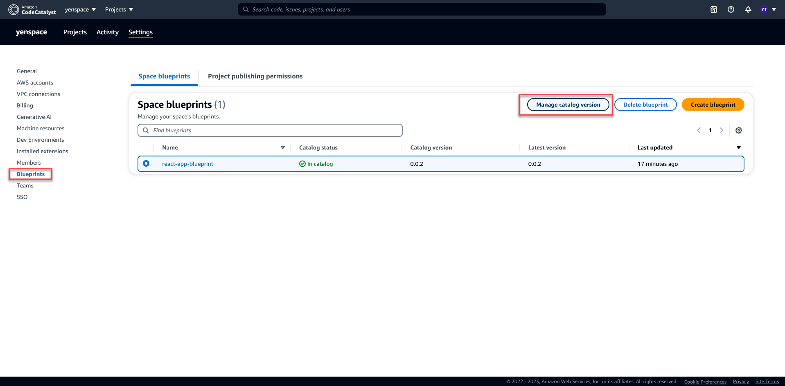

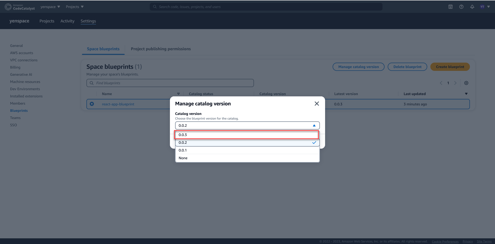

# Update project with new blueprint version
1. In the CodeCatalyst console, navigate to **react-app-project** project created in step Create project with blueprint.
2. In the navigation pane, choose **Blueprints**.
3. Choose **Update blueprint** in the info box.
4. In the right-side Code changes panel, you can see the `hello-world.txt` and `package.json` updates.
5. Choose Apply update.

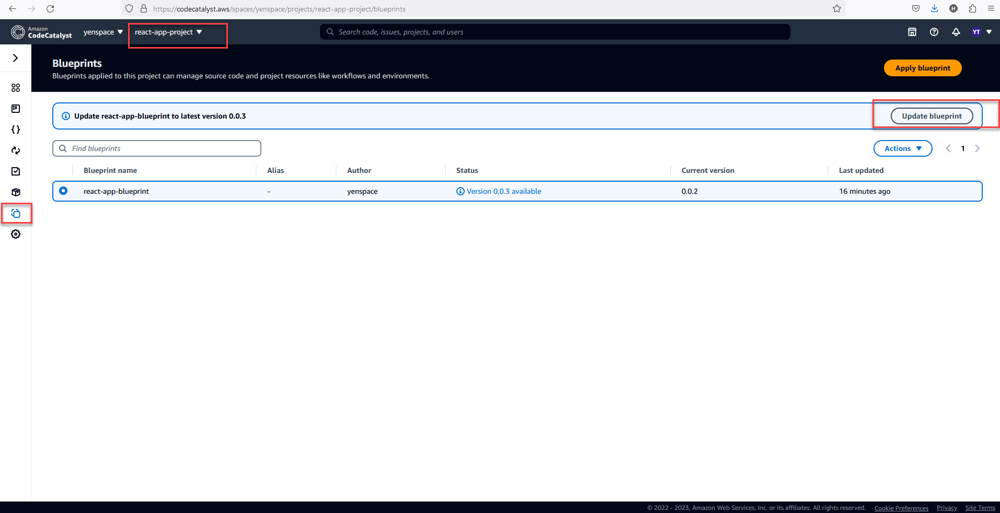

Choosing **Apply update** creates a pull request in the project with the changes from the updated blueprint version. To make the updates to the project, you must merge the pull request. 

1. In the **Blueprints** table, find the blueprint. In the Status column, choose **Pending pull request**, and then choose the link to the open pull request.

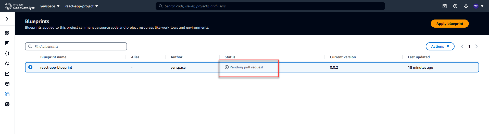

2. Review the pull request, and then choose **Merge**.

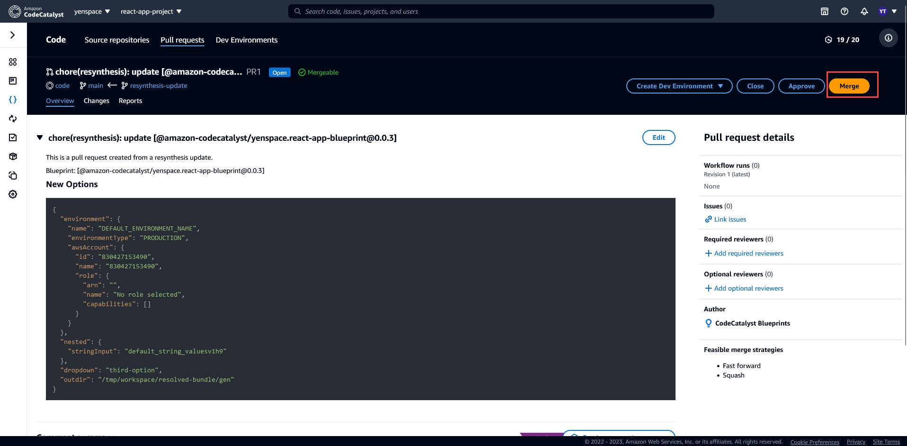

3. Choose **Fast forward merge** to keep the the default values, and then choose **Merge**.

# View the changes in the project
1. In the navigation pane, choose **Source repositories**, and then choose the name of the source repository created when the project was created.

2. Under **Files**, you can view the hello-world.txt file that was created in step Update blueprint.

3. Choose the `hello-world.txt`` to view the file's content.
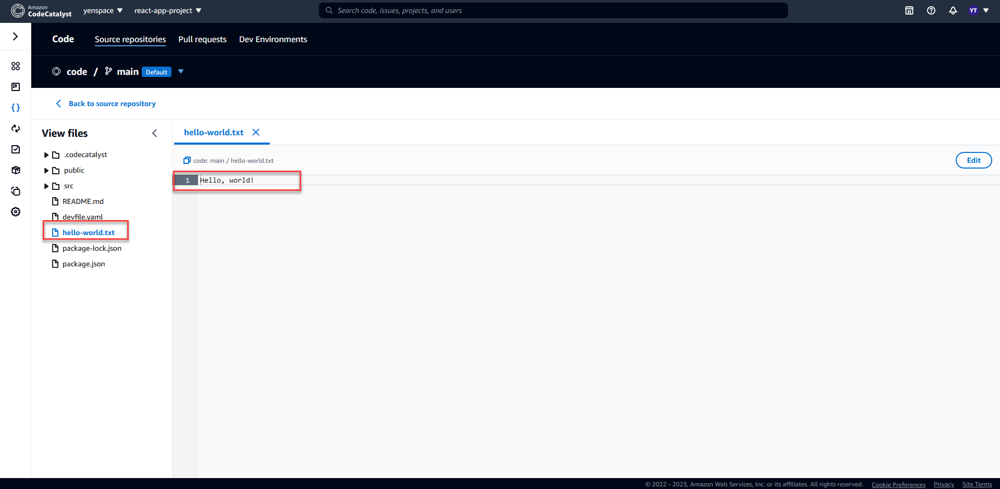