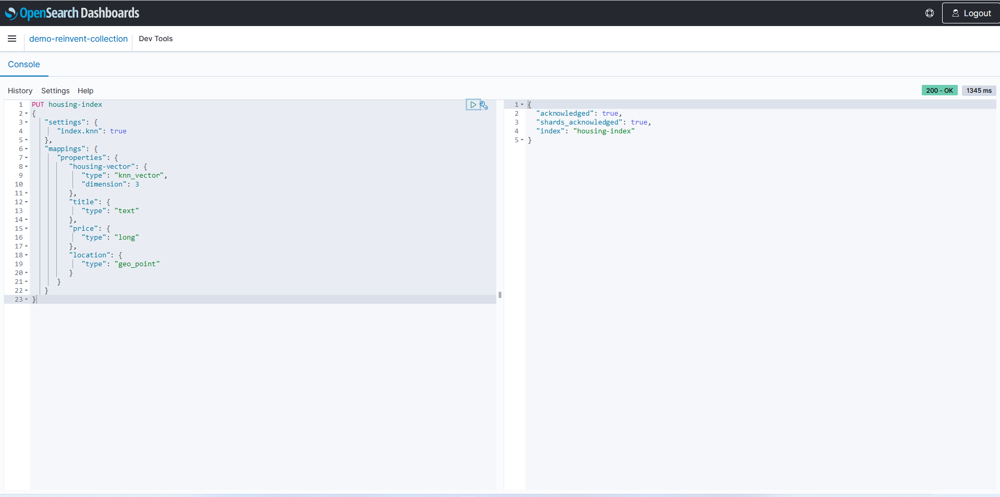

# Create OpenSearch Serverless collection: 
You can create OpenSearch serverless collection in the console that supported for Vector Engine as below:


But in this demo, to be simple, we will use CloudFormation template. To create, use the template: 

[opensearch-template.yaml](./opensearch-template.yaml)

We will deploy the CloudFormation stack with the following parameters.

**AossDataAccessPrincipalArnPlease**: specify the ARN of the IAM user or IAM role that will access the collection you are creating.


When the stack creation is completed, the OpenSearch Serverless endpoint URL will be output as shown below.

Please note this URL as it will be used later.


# Data upload/vector search

Please refer to the official document below for the data used in this confirmation and the confirmation procedure:

[Working with vector search collections](https://docs.aws.amazon.com/opensearch-service/latest/developerguide/serverless-vector-search.html)

An index is a collection of documents with a common data schema that provides a way for you to store, search, and retrieve your vector embeddings and other fields. You can create and upload data to indexes in an OpenSearch Serverless collection by using an HTTP tool such as Postman or awscurl, or use OpenSearch DevTool console.

1. Create a single index for your new collection:

```
PUT housing-index
{
   "settings": {
      "index.knn": true
   },
   "mappings": {
      "properties": {
         "housing-vector": {
            "type": "knn_vector",
            "dimension": 3
         },
         "title": {
            "type": "text"
         },
         "price": {
            "type": "long"
         },
         "location": {
            "type": "geo_point"
         }
      }
   }
}
```


2. To index a single document into housing-index, send the following request:

```
POST housing-index/_doc
{
  "housing-vector": [
    10,
    20,
    30
  ],
  "title": "2 bedroom in downtown Seattle",
  "price": "2800",
  "location": "47.71, 122.00"
}
```


3. To search for properties that are similar to the ones in your index, send the following query:

```
GET housing-index/_search
{
    "size": 5,
    "query": {
        "knn": {
            "housing-vector": {
                "vector": [
                    10,
                    20,
                    30
                ],
                "k": 5
            }
        }
    }
}
```


By following the steps above, we were able to confirm that vector searches can be performed successfully!